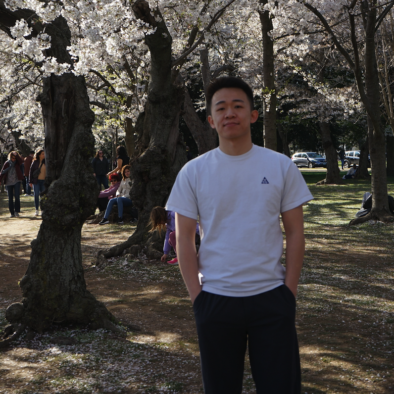

     

<!--  -->

### **About Me**

I am a PhD student at [Department of Statistics](https://science.psu.edu/stat), The Pennsylvania State University. I am fortunate to be advised by Professor [Matthew Reimherr](https://mreimherr.github.io/). Prior to this, I received my Bachelor degree in Statistics from University of Science and Technology of China. 

My research interests are mainly forcing on functional/longitudinal data, kernel methods and statistical transfer learning. In particular, I'm working on accurately and adaptively estimating the offset structure between different domains in transfer learning and multi-task learning.

<!-- ### **Education**

[The University of Chicago](https://www.uchicago.edu/)
* Ph.D. in Statistics, 2018
* Advisor: [Rina Foygel Barber](http://galton.uchicago.edu/~rina/)

[Seoul National University](http://en.snu.ac.kr/)
* M.S., Statistics, 2013 (Advisor: [Byeong U. Park](https://stat.snu.ac.kr/theostat/BUPark.htm))
* B.S., Statistics, B.A., Economics, Minor in Mathematics, 2011 -->

### **Preprints**

- Spectral Algorithms with Gaussian Kernels: Robustness and Optimality.\
  Haotian Lin and Matthew Reimherr \
  (Submitted)

- Smoothness Adaptive Hypothesis Transfer Learning.\
  Haotian Lin and Matthew Reimherr \
  (Submitted)

- On Hypothesis Transfer Learning in Functional Linear Models. \
  Haotian Lin and Matthew Reimherr \
  [[arXiv]](https://arxiv.org/abs/2206.04277) (Submitted)

- Pure Differential Privacy for Functional Summaries via a Laplce-like Process. \
  Haotian Lin and Matthew Reimherr \
  [[arXiv]](https://arxiv.org/abs/2309.00125) (JMLR under Revision)

### **Services**

I served as reviewer for the following Journal/Conference.

- Journal: Computational Statistics & Data Analysis; Journal of Statistical Computation and Simulation

- Conference: AISTATS 2024

<!-- ### **Extended Abstracts**

- Simultaneous spectral scaling and basis material map reconstruction for spectral CT with photon-counting detectors.
Emil Y Sidky, Taly Gilat Schmidt, Rina Foygel Barber, Wooseok Ha, and Xiaochuan Pan. 4th International Conference on Image Formation in X-ray Computed Tomography (_CT meeting 2016_). -->

### **Teaching at Penn State**

- STAT-440: Computational Statistics (Spring 2023).

- STAT-319: Elementary Mathematical Statistics (Spring 2022).
